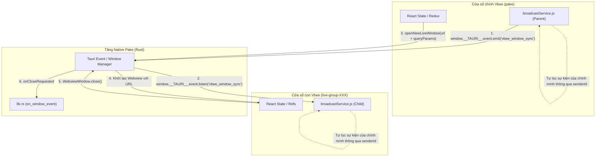

# Cơ Chế Truyền Dữ Liệu Giữa Pake (Tauri) và Vbee (React JS)

Tài liệu này tổng hợp chi tiết kiến trúc và các cơ chế truyền dữ liệu hai chiều giữa lớp vỏ Desktop **Pake (Tauri v2 - Rust)** và ứng dụng Web **Vbee (React JS)**, bao gồm cả luồng truyền tin xuyên cửa sổ (Multi-Window IPC).

---

## Sơ Đồ Tổng Quan Kiến Trúc Truyền Tin



---

## 1. Truyền Tham Số Khởi Tạo (Startup Parameters)

Khi mở một cửa sổ con mới từ thanh Sidebar hoặc Menu điều khiển của Vbee, dữ liệu được truyền **đồng bộ ngay từ lúc mount** thông qua tham số truy vấn URL (URL Query Parameters).

### Luồng xử lý:

1. **Ứng dụng chính (Vbee - Cửa sổ chính)**:
   Gọi hàm `openNewLiveWindow` trong [tauri.js](file:///d:/WebProject/CMC-Project/vbee_web_camera/src/helpers/tauri.js) để yêu cầu Pake tạo cửa sổ mới, đính kèm các tham số như Token, Namespace, Layout Grid hiện tại, Auto Switch, Auto Play:
   ```javascript
   const url = `/#/live?groupId=${groupId}&groupName=${encodeURIComponent(groupName)}&accessToken=${token}&namespace=${namespace}&gridSize=${gridSize}&autoSwitch=${autoSwitch}&autoPlay=${autoPlay}`;
   openNewLiveWindow(url, `live-group-${groupId}`, groupName);
   ```
2. **Cửa sổ con (Vbee - Cửa sổ con)**:
   Khi cửa sổ mới mở ra, React đọc trực tiếp các tham số này từ URL một cách đồng bộ trong quá trình khởi tạo State (bằng `useQuery` hoặc `URLSearchParams`), bỏ qua mọi độ trễ tải mạng hay xác thực bất đồng bộ:
   ```javascript
   const queryParams = new URLSearchParams(window.location.search);
   const [pagination, setPagination] = useState(() => {
     const sizeParam = queryParams.get("gridSize");
     const size = sizeParam ? Number(sizeParam) : 6;
     // Trả về cấu hình khởi tạo đồng bộ
   });
   ```

---

## 2. Giao Tiếp Giữa Các Webview (Cross-Window IPC)

On Windows, các cửa sổ webview của Tauri chạy trong các tiến trình WebView2 riêng biệt và bị cô lập thư mục User Data Folder (UDF). Điều này làm cho cơ chế chia sẻ bộ nhớ HTML5 tiêu chuẩn như `BroadcastChannel` **không hoạt động**.

Để giải quyết, Pake tận dụng và cấu hình hệ thống sự kiện toàn cục của Tauri v2 thông qua các quyền (Capabilities).

### A. Cấu Hình Quyền (Capabilities) trong Pake

Để cho phép JavaScript trong Webview phát và lắng nghe sự kiện toàn cục, file cấu hình Pake tại [default.json](file:///d:/WebProject/CMC-Project/Pake/src-tauri/capabilities/default.json) cấp quyền `event`:

```json
"permissions": [
  "core:event:allow-emit",
  "core:event:allow-listen"
]
```

### B. Cầu Nối Sự Kiện trong `broadcastService.js`

File [broadcastService.js](file:///d:/WebProject/CMC-Project/vbee_web_camera/src/services/broadcastService.js) tự động chuyển đổi giữa `BroadcastChannel` mặc định (nếu chạy trình duyệt thường) và sự kiện native của Tauri:

```javascript
// Phát tin nhắn
publish(type, targetWindowId, payload = {}) {
  const data = { type, targetWindowId, senderId: this.senderId, payload, timestamp: Date.now() };

  if (typeof window !== 'undefined' && window.__TAURI__?.event) {
    window.__TAURI__.event.emit('vbee_window_sync', data);
    return;
  }
  this.channel?.postMessage(data);
}
```

### C. Cơ Chế Chặn Vòng Lặp Phản Hồi (Self-Event Filtering)

Sự kiện toàn cục của Tauri phát đến **tất cả** cửa sổ đang lắng nghe, kể cả cửa sổ vừa phát đi sự kiện. Để giả lập hành vi chuẩn của `BroadcastChannel` (không nhận lại tin nhắn của chính mình) và tránh gây loop/nháy UI, hàm `subscribe` thực hiện lọc:

```javascript
subscribe(callback) {
  if (typeof window !== 'undefined' && window.__TAURI__?.event) {
    window.__TAURI__.event.listen('vbee_window_sync', (event) => {
      const message = event.payload;
      // Nếu ID người gửi trùng với ID cửa sổ hiện tại -> Bỏ qua
      if (message.senderId === this.senderId) {
        return;
      }
      callback(message);
    });
  }
}
```

## 3. Giao Tiếp Hai Chiều Giữa Webview và Native Rust (Tauri Command & Core IPC)

Khi ứng dụng Vbee (JavaScript) muốn thao tác trực tiếp hoặc gọi các xử lý nặng ở tầng hệ thống của Pake (Desktop Wrapper), Tauri cung cấp hai cơ chế giao tiếp IPC chính: **Tauri Commands** (dạng Request/Response tương tự HTTP API) và **Tauri Window Events** (lắng nghe sự kiện native từ hệ điều hành).

### A. Cơ chế Tauri Commands (RPC Invoke)

Cơ chế này sử dụng giao thức gọi hàm từ xa (Remote Procedure Call).

- **Cách gửi từ JS (Request)**: Sử dụng hàm `window.__TAURI__.core.invoke` để gửi tên lệnh kèm một object chứa các đối số. Dưới chân trang, webview sẽ tuần tự hóa (serialize) object này thành chuỗi JSON và đẩy qua cổng IPC (`postMessage` trên WebView2/Windows hoặc WebKit IPC trên macOS/Linux).
- **Cách nhận và xử lý ở Rust (Response)**: Pake khai báo các hàm Rust được đánh dấu bằng macro `#[tauri::command]`. Tauri tự động giải tuần tự (deserialize) chuỗi JSON nhận được từ webview thành các kiểu dữ liệu tương ứng trong Rust (sử dụng thư viện `serde_json`). Khi hàm Rust chạy xong, giá trị trả về được tự động chuyển ngược thành JSON gửi lại cho JavaScript giải quyết thông qua một `Promise` (resolve khi thành công, reject khi gặp lỗi).

#### Ví dụ thực tế lệnh đổi Theme (`update_theme_mode`):

1. **Phía Vbee (JS)**:
   ```javascript
   // Gửi đi payload JSON: {"mode": "dark"}
   window.__TAURI__.core
     .invoke("update_theme_mode", { mode: "dark" })
     .then(() => console.log("Đã cập nhật theme native!"))
     .catch((err) => console.error("Lỗi gọi lệnh:", err));
   ```
2. **Phía Pake (Rust)**:
   ```rust
   // Đăng ký lệnh trong generate_handler! ở lib.rs
   // Tauri tự động ánh xạ đối số `mode: String` từ JSON `mode` gửi lên
   #[tauri::command]
   pub async fn update_theme_mode(app: AppHandle, mode: String) {
       if let Some(window) = app.get_webview_window("pake") {
           let theme = if mode == "dark" { Theme::Dark } else { Theme::Light };
           let _ = window.set_theme(Some(theme));
       }
   }
   ```

### B. Các Lệnh Native Command do Pake Hỗ Trợ

Pake đăng ký danh sách các lệnh hệ thống để Vbee có thể gọi trực tiếp thông qua `invoke`:

- `download_file`: Kích hoạt trình tải xuống tệp tin native của hệ thống.
- `send_notification`: Gửi thông báo đẩy hệ thống (Native Desktop Notification).
- `increment_dock_badge` / `set_dock_badge` / `clear_dock_badge`: Điều khiển số huy hiệu trên thanh Taskbar/Dock.
- `update_theme_mode`: Thay đổi giao diện sáng/tối đồng bộ với hệ điều hành.
- `open_pake_window`: Mở một định dạng cửa sổ mới được cấu hình sẵn trong Pake.
- `set_window_decorations`: Bật/Tắt thanh tiêu đề (decorations) của cửa sổ native.

### C. Cơ Chế Lắng Nghe Sự Kiện Cửa Sổ Native (Tauri Window Events)

Khi hệ điều hành gửi tín hiệu thay đổi đến cửa sổ (như thay đổi kích thước, di chuyển, hoặc yêu cầu đóng), Tauri core nhận và phát vào luồng sự kiện `.on_window_event` ở Rust và chuyển tiếp vào hook `onCloseRequested` ở Javascript.

#### Ví dụ: Luồng đóng cửa sổ con từ Webview

1. **JavaScript trong Vbee gọi đóng cửa sổ**:
   Vbee gọi trực tiếp API Webview để đóng cửa sổ native hiện tại:
   ```javascript
   window.__TAURI__.webviewWindow.getCurrentWebviewWindow().close();
   ```
2. **Native Rust nhận lệnh và xử lý**:
   Tauri core nhận yêu cầu đóng, chuyển tiếp sự kiện đến hàm `.on_window_event` ở [lib.rs](file:///d:/WebProject/Pake/src-tauri/src/lib.rs):
   ```rust
   .on_window_event(move |_window, _event| {
       if let tauri::WindowEvent::CloseRequested { api, .. } = _event {
           // Rust có thể can thiệp: prevent_close() để ẩn thay vì đóng,
           // hoặc giải phóng tài nguyên trước khi tắt tiến trình.
       }
   })
   ```

---

## 4. Chi Tiết Định Dạng Dữ Liệu Gửi/Nhận (Data Format & Protocol)

Toàn bộ thông điệp đồng bộ xuyên cửa sổ (Cross-Window IPC) truyền qua cổng Tauri Event với tên sự kiện cố định là `'vbee_window_sync'`.

### A. Cấu trúc bao gói chung (Standard Envelope)

Tất cả các gói tin gửi đi đều tuân thủ cấu trúc JSON tiêu chuẩn sau:

```typescript
interface VbeeBroadcastEnvelope<T = any> {
  type: string; // Loại hành động/sự kiện (ví dụ: 'WINDOW_HEARTBEAT')
  targetWindowId: string; // Định danh cửa sổ nhận lệnh ('ALL' hoặc windowId cụ thể như 'live-group-3327')
  senderId: string; // Định danh cửa sổ gửi (nhãn cửa sổ Tauri như 'pake' hoặc 'live-group-3327')
  payload: T; // Dữ liệu chi tiết đi kèm gói tin
  timestamp: number; // Thời điểm gửi tin nhắn (Unix timestamp tính bằng ms)
}
```

### B. Chi tiết Payload của các Sự Kiện cụ thể

#### 1. Sự kiện `WINDOW_REGISTER` (Cửa sổ con báo danh khi mở ra)

- **Mục đích**: Cửa sổ con báo hiệu cho app chính biết nó vừa được mở và yêu cầu đồng bộ cấu hình hiện tại của app chính sang.
- **Payload Format**:
  ```json
  {
    "type": "WINDOW_REGISTER",
    "targetWindowId": "ALL",
    "senderId": "live-group-3327",
    "payload": {
      "windowId": "live-group-3327"
    },
    "timestamp": 1783914849597
  }
  ```

#### 2. Sự kiện `WINDOW_HEARTBEAT` (Nhịp tim báo cáo trạng thái định kỳ 3s)

- **Mục đích**: Cửa sổ con gửi thông số cấu hình hiện tại của nó về cho cửa sổ chính quản lý và duy trì kết nối.
- **Payload Format**:
  ```json
  {
    "type": "WINDOW_HEARTBEAT",
    "targetWindowId": "ALL",
    "senderId": "live-group-3327",
    "payload": {
      "windowId": "live-group-3327",
      "groupId": 3327,
      "groupName": "001 - HCQT Cộng Hoà",
      "gridMode": {
        "size": 16, // Số ô lưới hiển thị (ví dụ: 4, 9, 16, 25, 36)
        "grid": [4, 4] // Bố cục ma trận lưới tương ứng
      },
      "autoSwitch": 120, // Thời gian tự động chuyển trang (tính bằng giây, 0 là tắt)
      "autoPlay": "off" // Trạng thái tự động phát video ('on' hoặc 'off')
    },
    "timestamp": 1783914853981
  }
  ```

#### 3. Sự kiện `CHANGE_GRID_MODE` (Đổi bố cục lưới hiển thị)

- **Mục đích**: Yêu cầu cửa sổ con thay đổi cấu hình lưới camera.
- **Payload Format**:
  ```json
  {
    "type": "CHANGE_GRID_MODE",
    "targetWindowId": "live-group-3327", // Hoặc 'ALL'
    "senderId": "pake",
    "payload": {
      "size": 16,
      "grid": [4, 4],
      "quality": "TWO" // Chất lượng luồng video: 'THREE' (thấp), 'TWO' (trung bình), 'ONE' (cao)
    },
    "timestamp": 1783914860188
  }
  ```

#### 4. Sự kiện `CHANGE_AUTO_SWITCH` (Thay đổi thời gian chuyển trang)

- **Mục đích**: Cập nhật khoảng thời gian tự động đổi trang camera trên cửa sổ con.
- **Payload Format**:
  ```json
  {
    "type": "CHANGE_AUTO_SWITCH",
    "targetWindowId": "live-group-3327",
    "senderId": "pake",
    "payload": {
      "seconds": 120 // Số giây (0 là tắt chế độ tự động chuyển)
    },
    "timestamp": 1783914862179
  }
  ```

#### 5. Sự kiện `CHANGE_AUTO_PLAY` (Bật/tắt tự động phát)

- **Mục đích**: Cập nhật trạng thái tự động phát luồng video trên cửa sổ con.
- **Payload Format**:
  ```json
  {
    "type": "CHANGE_AUTO_PLAY",
    "targetWindowId": "live-group-3327",
    "senderId": "pake",
    "payload": {
      "autoPlay": "on" // 'on' (bật) hoặc 'off' (tắt)
    },
    "timestamp": 1783914862794
  }
  ```

#### 6. Sự kiện `CLOSE_WINDOW` (Lệnh đóng cửa sổ từ xa)

- **Mục đích**: Cửa sổ chính ra lệnh yêu cầu cửa sổ con tự đóng tiến trình hệ điều hành của nó lại.
- **Payload Format**:
  ```json
  {
    "type": "CLOSE_WINDOW",
    "targetWindowId": "live-group-3327",
    "senderId": "pake",
    "payload": {},
    "timestamp": 1783914863001
  }
  ```

#### 7. Sự kiện `WINDOW_UNREGISTER` (Cửa sổ con báo cáo khi sắp đóng)

- **Mục đích**: Cửa sổ con báo hiệu nó sắp tắt để ứng dụng chính xóa Card điều khiển trên màn hình ngay lập tức.
- **Payload Format**:
  ```json
  {
    "type": "WINDOW_UNREGISTER",
    "targetWindowId": "ALL",
    "senderId": "live-group-3327",
    "payload": {
      "windowId": "live-group-3327"
    },
    "timestamp": 1783914863102
  }
  ```

---

## 4. Tối Ưu Hóa & Đồng Bộ Trạng Thái Hiệu Năng Cao

### A. Heartbeat (Nhịp Tim) Không Re-render

- Cửa sổ con định kỳ phát lệnh `WINDOW_HEARTBEAT` để báo hiệu trạng thái hoạt động với cửa sổ chính.
- Ở cửa sổ chính ([WindowControlMode/index.js](file:///d:/WebProject/CMC-Project/vbee_web_camera/src/pages/Live/WindowControlMode/index.js)), mốc thời gian nhận nhịp tim cuối cùng được ghi nhận vào một `useRef` (`lastSeenRef`).
- Hệ thống chỉ cập nhật React State (kích hoạt render lại UI) khi phát hiện có **sự thay đổi cấu hình thực tế** (`gridMode`, `autoSwitch`, `autoPlay`), ngăn chặn tình trạng nhấp nháy UI liên tục.

### B. Tránh Vòng Lặp Đăng Ký (Register/Unregister Loop) bằng Ref

- Tại cửa sổ con, các cấu hình động được liên tục đồng bộ vào một `useRef` là `childStateRef`.
- Các biến state động được loại bỏ khỏi mảng dependencies của `useEffect` kết nối.
- Điều này giúp cửa sổ con **chỉ đăng ký duy nhất 1 lần khi mở ra** và **chỉ hủy đăng ký duy nhất 1 lần khi đóng lại**, tránh vòng lặp tái đăng ký liên tục khi nhận cập nhật cấu hình từ cửa sổ chính.

### C. Đóng Cửa Sổ Bất Đồng Bộ Tránh Treo Luồng (Asynchronous Close Dialog)

- Khi ghim sự kiện đóng native của hệ điều hành (`onCloseRequested`), việc sử dụng lệnh đồng bộ chặn luồng (`window.confirm`) sẽ đóng băng tiến trình giao tiếp IPC giữa Webview và Rust, gây ra hiện tượng đơ/lag cửa sổ.
- Thay vào đó, ứng dụng sử dụng `<Modal.confirm>` bất đồng bộ của Ant Design:

  ```javascript
  win.onCloseRequested(async (event) => {
    if (isClosingRef.current) return;
    event.preventDefault(); // Trả lại quyền ngay lập tức, tránh treo luồng

    Modal.confirm({
      title: "Xác nhận đóng",
      onOk: () => {
        isClosingRef.current = true;
        // Báo cho cửa sổ chính xóa UI ngay lập tức
        broadcastService.publish("WINDOW_UNREGISTER", "ALL", {
          windowId: currentWindowId,
        });
        setTimeout(() => win.close(), 100);
      },
    });
  });
  ```
